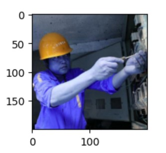
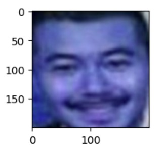
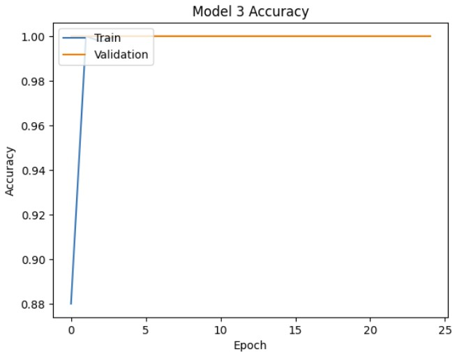
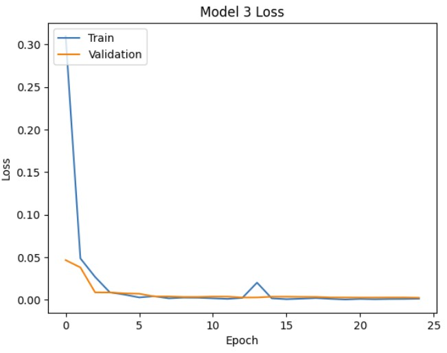
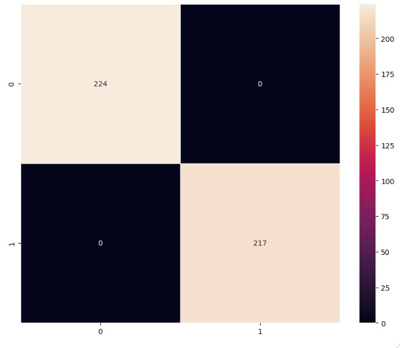
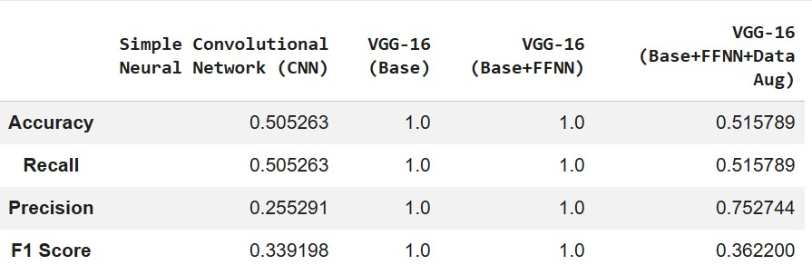
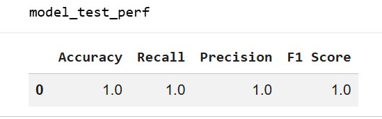
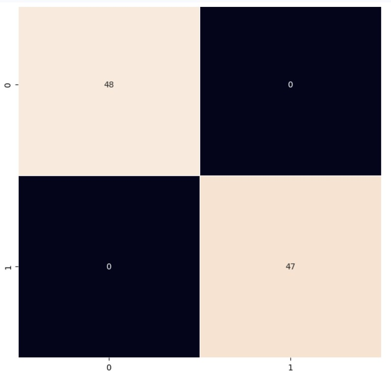

# **Automated Safety Helmet Detection Using Deep Learning**

## **Overview**
This project develops an automated image classification system to detect whether workers are wearing safety helmets in industrial and construction environments. The solution uses deep learning to support real‑time safety monitoring, reduce manual supervision, and strengthen compliance with workplace safety regulations.

This repository contains the full workflow: data exploration, preprocessing, model training, evaluation, insights, and recommendations for deployment.

---

## **Business Context**
Workplace safety is a critical priority in hazardous environments such as construction sites and industrial plants. Safety helmets protect workers from head injuries caused by falling objects, machinery, and collisions. Manual monitoring is labor‑intensive, error‑prone, and difficult to scale across large sites.

SafeGuard Corp aims to automate helmet compliance monitoring using computer vision. This project builds a deep learning model capable of classifying images into:

- **With Helmet**
- **Without Helmet**

The goal is to support real‑time safety enforcement and reduce accident risk.

---

## **Objective**
Develop a robust image classification model that accurately identifies whether a worker is wearing a safety helmet, suitable for deployment in real‑world monitoring systems.

---

## **Dataset Description**
The dataset contains **631 images**, evenly distributed across two classes:

| Class | Count |
|-------|--------|
| With Helmet | 311 |
| Without Helmet | 320 |

### **Dataset Characteristics**
- Images from construction sites, factories, and industrial settings  
- Variations in lighting, angles, and worker posture  
- Workers performing different activities (standing, using tools, moving)  
- Realistic conditions to ensure strong generalization  

---

## **Approach & Methodology**
The workflow includes:

- Data loading and preprocessing  
- Image augmentation  
- Training multiple deep learning models  
- Evaluating performance using accuracy, precision, recall, F1‑score  
- Confusion matrix analysis  
- Selecting the best model for deployment  

Models tested include:

- Baseline CNN  
- Transfer learning architectures  
- **VGG‑16 + Fully Connected Head (Model‑3)**  
- Additional variants with augmentation and fine‑tuning  

---

## **Results Summary**
Model‑3 (**VGG‑16 + FFNN**) achieved **perfect accuracy, precision, recall, and F1‑score** across training, validation, and test sets.

### **Why Model‑3 Wins**
- No overfitting  
- No train‑validation gap  
- Stable under different conditions  
- Strong generalization  
- Deployment‑ready performance  

Other models showed issues such as:

- Bias toward “no helmet” when augmentation was unbalanced  
- Performance collapse under heavy augmentation  
- Sensitivity to distortions that obscure helmet features  

---

## **Key Visuals**
- Sample images (helmet / no helmet)  
- Training & validation accuracy curves  
- Confusion matrix  
- Sample predictions  

---

## **Actionable Insights**
- **Model‑3 is the most reliable and generalizable model**  
- Heavy augmentation harms performance; lighter augmentation works best  
- Class imbalance must be handled to avoid false negatives  
- Stability across all splits indicates readiness for real‑world deployment  

---

## **Technical Recommendations**
- Use **Model‑3 (VGG‑16 + FFNN)** for production  
- Avoid aggressive augmentation unless fine‑tuned carefully  
- Apply class weights or oversampling to improve recall  
- Fine‑tune deeper VGG‑16 layers for adaptability  
- Add batch normalization for stability  
- Save and containerize the model for deployment  
- Retrain periodically with new data  

---

## **Business Recommendations**
- Deploy Model‑3 to enforce helmet compliance with perfect accuracy  
- Reduce manual supervision and improve operational

---

##Key Visuals

